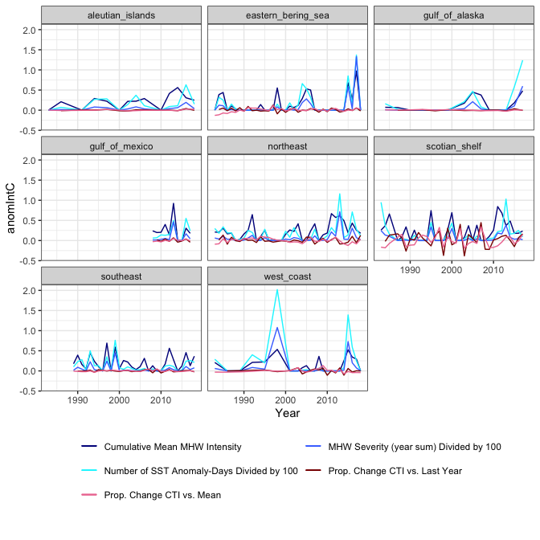

analyze\_CTI
================
Alexa Fredston
5/21/2021

    ## 
    ## Call:
    ## lm(formula = ctiDiffProp ~ anomIntC, data = ctiNamerSummary)
    ## 
    ## Residuals:
    ##      Min       1Q   Median       3Q      Max 
    ## -0.38890 -0.02877 -0.00616  0.02988  0.43822 
    ## 
    ## Coefficients:
    ##             Estimate Std. Error t value Pr(>|t|)
    ## (Intercept) 0.007064   0.008684   0.814    0.417
    ## anomIntC    0.001435   0.029777   0.048    0.962
    ## 
    ## Residual standard error: 0.08942 on 187 degrees of freedom
    ##   (8 observations deleted due to missingness)
    ## Multiple R-squared:  1.243e-05,  Adjusted R-squared:  -0.005335 
    ## F-statistic: 0.002324 on 1 and 187 DF,  p-value: 0.9616

    ## 
    ## Call:
    ## lm(formula = ctiAnomProp ~ anomIntC, data = ctiNamerSummary)
    ## 
    ## Residuals:
    ##      Min       1Q   Median       3Q      Max 
    ## -0.19888 -0.02631 -0.00306  0.02663  0.33126 
    ## 
    ## Coefficients:
    ##              Estimate Std. Error t value Pr(>|t|)  
    ## (Intercept)  0.009422   0.006678   1.411    0.160  
    ## anomIntC    -0.049252   0.023201  -2.123    0.035 *
    ## ---
    ## Signif. codes:  0 '***' 0.001 '**' 0.01 '*' 0.05 '.' 0.1 ' ' 1
    ## 
    ## Residual standard error: 0.07004 on 195 degrees of freedom
    ## Multiple R-squared:  0.02259,    Adjusted R-squared:  0.01758 
    ## F-statistic: 4.506 on 1 and 195 DF,  p-value: 0.03503

    ## 
    ## Call:
    ## lm(formula = ctiDiffProp ~ anomIntC + anomIntC * region, data = ctiNamerSummary)
    ## 
    ## Residuals:
    ##      Min       1Q   Median       3Q      Max 
    ## -0.41968 -0.02392 -0.00192  0.02583  0.40278 
    ## 
    ## Coefficients:
    ##                                     Estimate Std. Error t value Pr(>|t|)
    ## (Intercept)                       -0.0001083  0.0452583  -0.002    0.998
    ## anomIntC                           0.0072351  0.1631408   0.044    0.965
    ## regioneastern_bering_sea           0.0030956  0.0487847   0.063    0.949
    ## regiongulf_of_alaska               0.0010865  0.0552986   0.020    0.984
    ## regiongulf_of_mexico              -0.0267534  0.0625136  -0.428    0.669
    ## regionnortheast                    0.0047379  0.0509360   0.093    0.926
    ## regionscotian_shelf                0.0426202  0.0500986   0.851    0.396
    ## regionsoutheast                   -0.0018414  0.0516309  -0.036    0.972
    ## regionwest_coast                   0.0027649  0.0515265   0.054    0.957
    ## anomIntC:regioneastern_bering_sea  0.0112856  0.1754023   0.064    0.949
    ## anomIntC:regiongulf_of_alaska     -0.0175236  0.2169193  -0.081    0.936
    ## anomIntC:regiongulf_of_mexico      0.1074028  0.2003285   0.536    0.593
    ## anomIntC:regionnortheast          -0.0031187  0.1810428  -0.017    0.986
    ## anomIntC:regionscotian_shelf      -0.0685790  0.1747183  -0.393    0.695
    ## anomIntC:regionsoutheast           0.0013274  0.1852361   0.007    0.994
    ## anomIntC:regionwest_coast         -0.0211992  0.1975975  -0.107    0.915
    ## 
    ## Residual standard error: 0.09183 on 173 degrees of freedom
    ##   (8 observations deleted due to missingness)
    ## Multiple R-squared:  0.02418,    Adjusted R-squared:  -0.06043 
    ## F-statistic: 0.2858 on 15 and 173 DF,  p-value: 0.9961

    ## 
    ## Call:
    ## lm(formula = ctiAnomProp ~ anomIntC + anomIntC * region, data = ctiNamerSummary)
    ## 
    ## Residuals:
    ##       Min        1Q    Median        3Q       Max 
    ## -0.223480 -0.019845 -0.001255  0.025624  0.295854 
    ## 
    ## Coefficients:
    ##                                     Estimate Std. Error t value Pr(>|t|)
    ## (Intercept)                        0.0013360  0.0310235   0.043    0.966
    ## anomIntC                          -0.0062740  0.1160508  -0.054    0.957
    ## regioneastern_bering_sea          -0.0001493  0.0338941  -0.004    0.996
    ## regiongulf_of_alaska              -0.0003257  0.0388551  -0.008    0.993
    ## regiongulf_of_mexico              -0.0179820  0.0445496  -0.404    0.687
    ## regionnortheast                   -0.0013300  0.0357345  -0.037    0.970
    ## regionscotian_shelf                0.0434934  0.0350500   1.241    0.216
    ## regionsoutheast                   -0.0007591  0.0362698  -0.021    0.983
    ## regionwest_coast                   0.0074179  0.0362265   0.205    0.838
    ## anomIntC:regioneastern_bering_sea -0.0019836  0.1259642  -0.016    0.987
    ## anomIntC:regiongulf_of_alaska     -0.0015878  0.1590734  -0.010    0.992
    ## anomIntC:regiongulf_of_mexico      0.0705122  0.1461383   0.483    0.630
    ## anomIntC:regionnortheast           0.0062470  0.1306362   0.048    0.962
    ## anomIntC:regionscotian_shelf      -0.1883187  0.1255040  -1.500    0.135
    ## anomIntC:regionsoutheast           0.0034604  0.1340149   0.026    0.979
    ## anomIntC:regionwest_coast         -0.0574848  0.1437709  -0.400    0.690
    ## 
    ## Residual standard error: 0.07018 on 181 degrees of freedom
    ## Multiple R-squared:  0.08912,    Adjusted R-squared:  0.01363 
    ## F-statistic: 1.181 on 15 and 181 DF,  p-value: 0.2903
