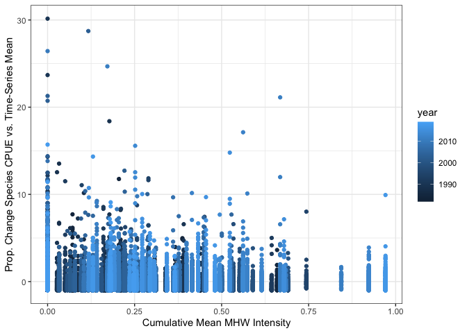
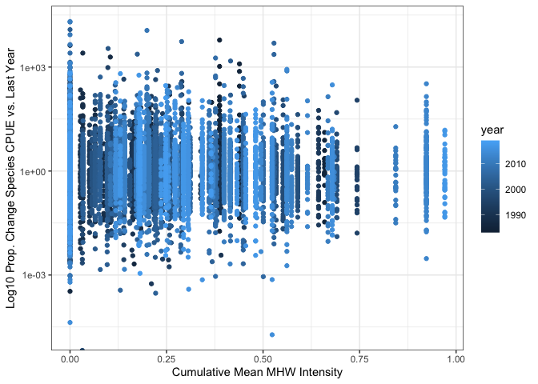
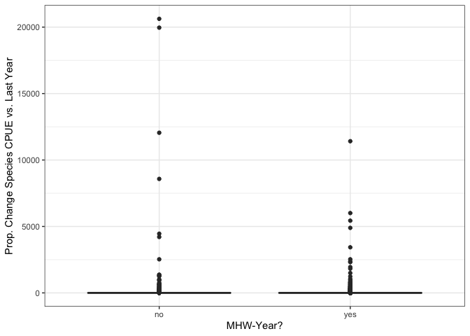

Analyzing MHW effects on fish abundance in trawl surveys
================
Alexa Fredston
3/23/2021

# North America

Note that as of 05-20-2021, I’ve updated the analysis such that every
survey is compared to MHW data from the 12 months preceding the earliest
start month of the survey. Different seasons in a region are pooled, so
e.g., the spring and fall NEUS surveys are compared to data from the 365
days before February 1 of each survey-year.

## Plots

### Net changes in biomass

Let’s plot several marine heatwave indices against several CPUE indices,
to see how similar patterns are across metrics. I’m also looking for
whether we see effects of major known MHW events: 2012 in the Northeast,
the 2014-2015 “warm blob” on the West Coast, and the 2014-2016 heatwave
and partially sea ice-free period in the Eastern Bering Sea. (The other
such event in the Eastern Bering Sea was 2001-2005, which also appears
to show up here.)

In addition to summing all CPUE (which will be driven by common species)
I’ve calculated proportional change first at the single-species level
and then averaged across all species in a region. This gives all species
equal weight while also standardizing and centering catch values. This
is shown below both as an absolute value (magnitude of change only) and
from averaging across true units of single-species values.

### Species-level

<!-- -->

<!-- -->

<!-- -->

## Models

### MHW yes/no

    ## 
    ## Call:
    ## lm(formula = wtMtDiffProp ~ mhwYesNo, data = .)
    ## 
    ## Residuals:
    ##      Min       1Q   Median       3Q      Max 
    ## -0.70427 -0.23161 -0.06323  0.16083  2.39913 
    ## 
    ## Coefficients:
    ##             Estimate Std. Error t value Pr(>|t|)  
    ## (Intercept)  0.08590    0.04694   1.830   0.0688 .
    ## mhwYesNoyes -0.02584    0.05938  -0.435   0.6639  
    ## ---
    ## Signif. codes:  0 '***' 0.001 '**' 0.01 '*' 0.05 '.' 0.1 ' ' 1
    ## 
    ## Residual standard error: 0.3983 on 190 degrees of freedom
    ##   (5 observations deleted due to missingness)
    ## Multiple R-squared:  0.0009959,  Adjusted R-squared:  -0.004262 
    ## F-statistic: 0.1894 on 1 and 190 DF,  p-value: 0.6639

    ## 
    ## Call:
    ## lm(formula = wtMtAnomProp ~ mhwYesNo, data = .)
    ## 
    ## Residuals:
    ##     Min      1Q  Median      3Q     Max 
    ## -0.6760 -0.2309 -0.0440  0.1549  1.4186 
    ## 
    ## Coefficients:
    ##             Estimate Std. Error t value Pr(>|t|)
    ## (Intercept) -0.04152    0.03978  -1.044    0.298
    ## mhwYesNoyes  0.07567    0.05014   1.509    0.133
    ## 
    ## Residual standard error: 0.3398 on 195 degrees of freedom
    ## Multiple R-squared:  0.01155,    Adjusted R-squared:  0.006477 
    ## F-statistic: 2.278 on 1 and 195 DF,  p-value: 0.1329

    ## 
    ## Call:
    ## lm(formula = wtMtAnomProp ~ mhwYesNo + mhwYesNo * region, data = .)
    ## 
    ## Residuals:
    ##      Min       1Q   Median       3Q      Max 
    ## -0.64832 -0.22020 -0.05423  0.12334  1.38460 
    ## 
    ## Coefficients:
    ##                                      Estimate Std. Error t value Pr(>|t|)
    ## (Intercept)                          -0.17697    0.17530  -1.009    0.314
    ## mhwYesNoyes                           0.24775    0.20742   1.194    0.234
    ## regioneastern_bering_sea              0.13575    0.19127   0.710    0.479
    ## regiongulf_of_alaska                  0.17535    0.21976   0.798    0.426
    ## regiongulf_of_mexico                  0.14074    0.30364   0.464    0.644
    ## regionnortheast                       0.05408    0.21470   0.252    0.801
    ## regionscotian_shelf                   0.16589    0.20047   0.828    0.409
    ## regionsoutheast                       0.15097    0.22632   0.667    0.506
    ## regionwest_coast                      0.16942    0.20242   0.837    0.404
    ## mhwYesNoyes:regioneastern_bering_sea -0.13110    0.23890  -0.549    0.584
    ## mhwYesNoyes:regiongulf_of_alaska     -0.24452    0.27955  -0.875    0.383
    ## mhwYesNoyes:regiongulf_of_mexico     -0.11152    0.34620  -0.322    0.748
    ## mhwYesNoyes:regionnortheast          -0.10459    0.25056  -0.417    0.677
    ## mhwYesNoyes:regionscotian_shelf      -0.21359    0.24152  -0.884    0.378
    ## mhwYesNoyes:regionsoutheast          -0.21526    0.26198  -0.822    0.412
    ## mhwYesNoyes:regionwest_coast         -0.20612    0.25386  -0.812    0.418
    ## 
    ## Residual standard error: 0.3506 on 181 degrees of freedom
    ## Multiple R-squared:  0.0235, Adjusted R-squared:  -0.05743 
    ## F-statistic: 0.2904 on 15 and 181 DF,  p-value: 0.9958

    ## 
    ## Call:
    ## lm(formula = wtMtDiffProp ~ mhwYesNo + mhwYesNo * region, data = .)
    ## 
    ## Residuals:
    ##      Min       1Q   Median       3Q      Max 
    ## -0.83031 -0.22458 -0.06921  0.16219  2.36549 
    ## 
    ## Coefficients:
    ##                                       Estimate Std. Error t value Pr(>|t|)
    ## (Intercept)                           0.239499   0.235876   1.015    0.311
    ## mhwYesNoyes                          -0.117789   0.268940  -0.438    0.662
    ## regioneastern_bering_sea             -0.215028   0.252162  -0.853    0.395
    ## regiongulf_of_alaska                 -0.243031   0.281926  -0.862    0.390
    ## regiongulf_of_mexico                  0.078167   0.372952   0.210    0.834
    ## regionnortheast                      -0.169936   0.276589  -0.614    0.540
    ## regionscotian_shelf                  -0.163900   0.261681  -0.626    0.532
    ## regionsoutheast                      -0.202663   0.288888  -0.702    0.484
    ## regionwest_coast                     -0.024379   0.263717  -0.092    0.926
    ## mhwYesNoyes:regioneastern_bering_sea  0.129322   0.302331   0.428    0.669
    ## mhwYesNoyes:regiongulf_of_alaska      0.135648   0.352125   0.385    0.701
    ## mhwYesNoyes:regiongulf_of_mexico     -0.285648   0.423827  -0.674    0.501
    ## mhwYesNoyes:regionnortheast           0.103267   0.314887   0.328    0.743
    ## mhwYesNoyes:regionscotian_shelf       0.119988   0.305150   0.393    0.695
    ## mhwYesNoyes:regionsoutheast           0.161485   0.327726   0.493    0.623
    ## mhwYesNoyes:regionwest_coast         -0.003635   0.320826  -0.011    0.991
    ## 
    ## Residual standard error: 0.4085 on 176 degrees of freedom
    ##   (5 observations deleted due to missingness)
    ## Multiple R-squared:  0.02645,    Adjusted R-squared:  -0.05652 
    ## F-statistic: 0.3188 on 15 and 176 DF,  p-value: 0.993

    ## 
    ## Call:
    ## lm(formula = wtMtDiffProp ~ mhwYesNo + mhwYesNo * region, data = .)
    ## 
    ## Residuals:
    ##     Min      1Q  Median      3Q     Max 
    ##   -22.5   -12.8    -4.7    -2.2 20602.9 
    ## 
    ## Coefficients:
    ##                                      Estimate Std. Error t value Pr(>|t|)
    ## (Intercept)                            6.3178    10.9895   0.575    0.565
    ## mhwYesNoyes                            0.9001    12.4403   0.072    0.942
    ## regioneastern_bering_sea              15.1725    11.6981   1.297    0.195
    ## regiongulf_of_alaska                  -1.9772    12.4988  -0.158    0.874
    ## regiongulf_of_mexico                  -4.5361    14.1895  -0.320    0.749
    ## regionnortheast                       -4.2561    13.8377  -0.308    0.758
    ## regionscotian_shelf                   -5.5657    15.1367  -0.368    0.713
    ## regionsoutheast                       -4.9806    13.9939  -0.356    0.722
    ## regionwest_coast                       7.1538    12.1258   0.590    0.555
    ## mhwYesNoyes:regioneastern_bering_sea  -8.7221    13.8928  -0.628    0.530
    ## mhwYesNoyes:regiongulf_of_alaska       1.3787    15.1942   0.091    0.928
    ## mhwYesNoyes:regiongulf_of_mexico       5.9398    16.0820   0.369    0.712
    ## mhwYesNoyes:regionnortheast            0.2012    15.6778   0.013    0.990
    ## mhwYesNoyes:regionscotian_shelf       -0.1979    18.1879  -0.011    0.991
    ## mhwYesNoyes:regionsoutheast           -0.1402    15.7881  -0.009    0.993
    ## mhwYesNoyes:regionwest_coast         -10.8202    14.5734  -0.742    0.458
    ## 
    ## Residual standard error: 231.8 on 25524 degrees of freedom
    ## Multiple R-squared:  0.0008083,  Adjusted R-squared:  0.0002211 
    ## F-statistic: 1.376 on 15 and 25524 DF,  p-value: 0.1486

    ## 
    ## Call:
    ## lm(formula = wtMtAnomProp ~ mhwYesNo + mhwYesNo * region, data = .)
    ## 
    ## Residuals:
    ##     Min      1Q  Median      3Q     Max 
    ## -1.0917 -0.7308 -0.2928  0.2872 30.1611 
    ## 
    ## Coefficients:
    ##                                       Estimate Std. Error t value Pr(>|t|)   
    ## (Intercept)                          -0.058904   0.048017  -1.227  0.21994   
    ## mhwYesNoyes                           0.082465   0.056815   1.451  0.14666   
    ## regioneastern_bering_sea              0.051251   0.052465   0.977  0.32865   
    ## regiongulf_of_alaska                  0.056695   0.057174   0.992  0.32139   
    ## regiongulf_of_mexico                  0.150633   0.068356   2.204  0.02756 * 
    ## regionnortheast                      -0.182322   0.065974  -2.764  0.00572 **
    ## regionscotian_shelf                   0.002751   0.073965   0.037  0.97033   
    ## regionsoutheast                      -0.148123   0.066934  -2.213  0.02691 * 
    ## regionwest_coast                      0.100922   0.055023   1.834  0.06664 . 
    ## mhwYesNoyes:regioneastern_bering_sea -0.060024   0.065578  -0.915  0.36004   
    ## mhwYesNoyes:regiongulf_of_alaska     -0.078047   0.071794  -1.087  0.27700   
    ## mhwYesNoyes:regiongulf_of_mexico     -0.107915   0.078655  -1.372  0.17007   
    ## mhwYesNoyes:regionnortheast           0.214079   0.076583   2.795  0.00519 **
    ## mhwYesNoyes:regionscotian_shelf       0.018524   0.091392   0.203  0.83938   
    ## mhwYesNoyes:regionsoutheast           0.176405   0.077116   2.288  0.02217 * 
    ## mhwYesNoyes:regionwest_coast         -0.120280   0.069141  -1.740  0.08193 . 
    ## ---
    ## Signif. codes:  0 '***' 0.001 '**' 0.01 '*' 0.05 '.' 0.1 ' ' 1
    ## 
    ## Residual standard error: 1.267 on 27967 degrees of freedom
    ## Multiple R-squared:  0.002639,   Adjusted R-squared:  0.002104 
    ## F-statistic: 4.933 on 15 and 27967 DF,  p-value: 8.884e-10

### Net change in biomass

    ## 
    ## Call:
    ## lm(formula = wtMtDiffProp ~ anomIntC, data = .)
    ## 
    ## Residuals:
    ##     Min      1Q  Median      3Q     Max 
    ## -0.7305 -0.2202 -0.0679  0.1471  2.4034 
    ## 
    ## Coefficients:
    ##             Estimate Std. Error t value Pr(>|t|)   
    ## (Intercept)  0.11528    0.03812   3.024  0.00284 **
    ## anomIntC    -0.23634    0.13129  -1.800  0.07343 . 
    ## ---
    ## Signif. codes:  0 '***' 0.001 '**' 0.01 '*' 0.05 '.' 0.1 ' ' 1
    ## 
    ## Residual standard error: 0.3952 on 190 degrees of freedom
    ##   (5 observations deleted due to missingness)
    ## Multiple R-squared:  0.01677,    Adjusted R-squared:  0.01159 
    ## F-statistic:  3.24 on 1 and 190 DF,  p-value: 0.07343

    ## 
    ## Call:
    ## lm(formula = wtMtAnomProp ~ anomIntC, data = .)
    ## 
    ## Residuals:
    ##      Min       1Q   Median       3Q      Max 
    ## -0.69222 -0.21929 -0.05445  0.13917  1.38791 
    ## 
    ## Coefficients:
    ##             Estimate Std. Error t value Pr(>|t|)
    ## (Intercept) -0.01086    0.03254  -0.334    0.739
    ## anomIntC     0.08869    0.11306   0.785    0.434
    ## 
    ## Residual standard error: 0.3413 on 195 degrees of freedom
    ## Multiple R-squared:  0.003146,   Adjusted R-squared:  -0.001966 
    ## F-statistic: 0.6155 on 1 and 195 DF,  p-value: 0.4337

    ## 
    ## Call:
    ## lm(formula = wtMtDiffProp ~ anomIntC + anomIntC * region, data = .)
    ## 
    ## Residuals:
    ##      Min       1Q   Median       3Q      Max 
    ## -0.81442 -0.22484 -0.06427  0.14614  2.33375 
    ## 
    ## Coefficients:
    ##                                    Estimate Std. Error t value Pr(>|t|)
    ## (Intercept)                        0.197467   0.199781   0.988    0.324
    ## anomIntC                          -0.211822   0.720143  -0.294    0.769
    ## regioneastern_bering_sea          -0.123005   0.214779  -0.573    0.568
    ## regiongulf_of_alaska              -0.142156   0.244101  -0.582    0.561
    ## regiongulf_of_mexico               0.012663   0.275950   0.046    0.963
    ## regionnortheast                   -0.132985   0.224512  -0.592    0.554
    ## regionscotian_shelf               -0.094382   0.220883  -0.427    0.670
    ## regionsoutheast                   -0.070092   0.227911  -0.308    0.759
    ## regionwest_coast                   0.001767   0.227450   0.008    0.994
    ## anomIntC:regioneastern_bering_sea -0.102619   0.773728  -0.133    0.895
    ## anomIntC:regiongulf_of_alaska     -0.168972   0.957535  -0.176    0.860
    ## anomIntC:regiongulf_of_mexico     -0.577602   0.884299  -0.653    0.514
    ## anomIntC:regionnortheast           0.183860   0.799159   0.230    0.818
    ## anomIntC:regionscotian_shelf       0.098408   0.771229   0.128    0.899
    ## anomIntC:regionsoutheast          -0.059461   0.817677  -0.073    0.942
    ## anomIntC:regionwest_coast         -0.081417   0.872244  -0.093    0.926
    ## 
    ## Residual standard error: 0.4054 on 176 degrees of freedom
    ##   (5 observations deleted due to missingness)
    ## Multiple R-squared:  0.04154,    Adjusted R-squared:  -0.04014 
    ## F-statistic: 0.5086 on 15 and 176 DF,  p-value: 0.9338

    ## 
    ## Call:
    ## lm(formula = wtMtAnomProp ~ anomIntC + anomIntC * region, data = .)
    ## 
    ## Residuals:
    ##      Min       1Q   Median       3Q      Max 
    ## -0.66371 -0.19832 -0.05402  0.15423  1.35874 
    ## 
    ## Coefficients:
    ##                                   Estimate Std. Error t value Pr(>|t|)  
    ## (Intercept)                       -0.21589    0.15279  -1.413   0.1594  
    ## anomIntC                           1.01385    0.57156   1.774   0.0778 .
    ## regioneastern_bering_sea           0.21356    0.16693   1.279   0.2024  
    ## regiongulf_of_alaska               0.21553    0.19137   1.126   0.2615  
    ## regiongulf_of_mexico               0.39768    0.21941   1.812   0.0716 .
    ## regionnortheast                    0.06111    0.17600   0.347   0.7288  
    ## regionscotian_shelf                0.24088    0.17263   1.395   0.1646  
    ## regionsoutheast                    0.24848    0.17863   1.391   0.1659  
    ## regionwest_coast                   0.23420    0.17842   1.313   0.1910  
    ## anomIntC:regioneastern_bering_sea -0.94620    0.62039  -1.525   0.1290  
    ## anomIntC:regiongulf_of_alaska     -1.01104    0.78345  -1.290   0.1985  
    ## anomIntC:regiongulf_of_mexico     -1.43464    0.71975  -1.993   0.0477 *
    ## anomIntC:regionnortheast          -0.36925    0.64340  -0.574   0.5667  
    ## anomIntC:regionscotian_shelf      -1.07881    0.61812  -1.745   0.0826 .
    ## anomIntC:regionsoutheast          -1.17279    0.66004  -1.777   0.0773 .
    ## anomIntC:regionwest_coast         -1.05715    0.70809  -1.493   0.1372  
    ## ---
    ## Signif. codes:  0 '***' 0.001 '**' 0.01 '*' 0.05 '.' 0.1 ' ' 1
    ## 
    ## Residual standard error: 0.3456 on 181 degrees of freedom
    ## Multiple R-squared:  0.051,  Adjusted R-squared:  -0.02765 
    ## F-statistic: 0.6484 on 15 and 181 DF,  p-value: 0.8315

    ## 
    ## Call:
    ## lm(formula = wtMtAnomProp ~ anomDays + anomDays * region, data = .)
    ## 
    ## Residuals:
    ##      Min       1Q   Median       3Q      Max 
    ## -0.73711 -0.20041 -0.05331  0.13460  1.36734 
    ## 
    ## Coefficients:
    ##                                     Estimate Std. Error t value Pr(>|t|)  
    ## (Intercept)                       -0.1255453  0.1230260  -1.020   0.3089  
    ## anomDays                           0.0079173  0.0052650   1.504   0.1344  
    ## regioneastern_bering_sea           0.1275979  0.1381275   0.924   0.3568  
    ## regiongulf_of_alaska               0.1590611  0.1613402   0.986   0.3255  
    ## regiongulf_of_mexico               0.3867858  0.1948885   1.985   0.0487 *
    ## regionnortheast                   -0.0067472  0.1423533  -0.047   0.9622  
    ## regionscotian_shelf                0.1339660  0.1410306   0.950   0.3434  
    ## regionsoutheast                    0.2315290  0.1464065   1.581   0.1155  
    ## regionwest_coast                   0.1352572  0.1457049   0.928   0.3545  
    ## anomDays:regioneastern_bering_sea -0.0075398  0.0056182  -1.342   0.1813  
    ## anomDays:regiongulf_of_alaska     -0.0096173  0.0058945  -1.632   0.1045  
    ## anomDays:regiongulf_of_mexico     -0.0181610  0.0078382  -2.317   0.0216 *
    ## anomDays:regionnortheast          -0.0009949  0.0058430  -0.170   0.8650  
    ## anomDays:regionscotian_shelf      -0.0078149  0.0057798  -1.352   0.1780  
    ## anomDays:regionsoutheast          -0.0158069  0.0064431  -2.453   0.0151 *
    ## anomDays:regionwest_coast         -0.0078029  0.0054595  -1.429   0.1547  
    ## ---
    ## Signif. codes:  0 '***' 0.001 '**' 0.01 '*' 0.05 '.' 0.1 ' ' 1
    ## 
    ## Residual standard error: 0.3381 on 181 degrees of freedom
    ## Multiple R-squared:  0.09194,    Adjusted R-squared:  0.01668 
    ## F-statistic: 1.222 on 15 and 181 DF,  p-value: 0.2589

    ## 
    ## Call:
    ## lm(formula = wtMtDiffProp ~ anomDays + anomDays * region, data = .)
    ## 
    ## Residuals:
    ##      Min       1Q   Median       3Q      Max 
    ## -0.81835 -0.20432 -0.05451  0.14403  2.27109 
    ## 
    ## Coefficients:
    ##                                     Estimate Std. Error t value Pr(>|t|)
    ## (Intercept)                        0.2119580  0.1562203   1.357    0.177
    ## anomDays                          -0.0036931  0.0064424  -0.573    0.567
    ## regioneastern_bering_sea          -0.1369038  0.1729795  -0.791    0.430
    ## regiongulf_of_alaska              -0.1657378  0.2015945  -0.822    0.412
    ## regiongulf_of_mexico               0.0585408  0.2481973   0.236    0.814
    ## regionnortheast                   -0.1374692  0.1777076  -0.774    0.440
    ## regionscotian_shelf               -0.1940807  0.1762261  -1.101    0.272
    ## regionsoutheast                   -0.0947446  0.1829427  -0.518    0.605
    ## regionwest_coast                  -0.0087994  0.1822422  -0.048    0.962
    ## anomDays:regioneastern_bering_sea  0.0004553  0.0068471   0.066    0.947
    ## anomDays:regiongulf_of_alaska      0.0016176  0.0071652   0.226    0.822
    ## anomDays:regiongulf_of_mexico     -0.0097876  0.0095485  -1.025    0.307
    ## anomDays:regionnortheast           0.0027632  0.0071054   0.389    0.698
    ## anomDays:regionscotian_shelf       0.0074688  0.0070327   1.062    0.290
    ## anomDays:regionsoutheast           0.0003192  0.0077993   0.041    0.967
    ## anomDays:regionwest_coast          0.0018097  0.0066652   0.272    0.786
    ## 
    ## Residual standard error: 0.3999 on 176 degrees of freedom
    ##   (5 observations deleted due to missingness)
    ## Multiple R-squared:  0.06727,    Adjusted R-squared:  -0.01223 
    ## F-statistic: 0.8462 on 15 and 176 DF,  p-value: 0.6253

    ## 
    ## Call:
    ## lm(formula = wtMtAnomProp ~ anomSev + anomSev * region, data = .)
    ## 
    ## Residuals:
    ##      Min       1Q   Median       3Q      Max 
    ## -0.70432 -0.19681 -0.05551  0.13353  1.36676 
    ## 
    ## Coefficients:
    ##                                  Estimate Std. Error t value Pr(>|t|)  
    ## (Intercept)                      -0.14412    0.12154  -1.186   0.2373  
    ## anomSev                           0.03207    0.01813   1.769   0.0786 .
    ## regioneastern_bering_sea          0.14935    0.13530   1.104   0.2711  
    ## regiongulf_of_alaska              0.17755    0.15675   1.133   0.2588  
    ## regiongulf_of_mexico              0.32109    0.17368   1.849   0.0661 .
    ## regionnortheast                   0.05405    0.13709   0.394   0.6938  
    ## regionscotian_shelf               0.16011    0.13952   1.148   0.2527  
    ## regionsoutheast                   0.21731    0.14026   1.549   0.1230  
    ## regionwest_coast                  0.15441    0.14313   1.079   0.2821  
    ## anomSev:regioneastern_bering_sea -0.03180    0.01828  -1.740   0.0836 .
    ## anomSev:regiongulf_of_alaska     -0.03679    0.01902  -1.934   0.0547 .
    ## anomSev:regiongulf_of_mexico     -0.04505    0.01977  -2.279   0.0238 *
    ## anomSev:regionnortheast          -0.02020    0.01866  -1.082   0.2805  
    ## anomSev:regionscotian_shelf      -0.03297    0.01896  -1.739   0.0838 .
    ## anomSev:regionsoutheast          -0.04635    0.01925  -2.407   0.0171 *
    ## anomSev:regionwest_coast         -0.03186    0.01833  -1.738   0.0839 .
    ## ---
    ## Signif. codes:  0 '***' 0.001 '**' 0.01 '*' 0.05 '.' 0.1 ' ' 1
    ## 
    ## Residual standard error: 0.3375 on 181 degrees of freedom
    ## Multiple R-squared:  0.09539,    Adjusted R-squared:  0.02043 
    ## F-statistic: 1.272 on 15 and 181 DF,  p-value: 0.2235

    ## 
    ## Call:
    ## lm(formula = wtMtDiffProp ~ anomSev + anomSev * region, data = .)
    ## 
    ## Residuals:
    ##      Min       1Q   Median       3Q      Max 
    ## -0.80939 -0.21852 -0.06045  0.14707  2.27169 
    ## 
    ## Coefficients:
    ##                                   Estimate Std. Error t value Pr(>|t|)
    ## (Intercept)                       0.206046   0.155208   1.328    0.186
    ## anomSev                          -0.011809   0.022308  -0.529    0.597
    ## regioneastern_bering_sea         -0.142545   0.170610  -0.836    0.405
    ## regiongulf_of_alaska             -0.149112   0.198074  -0.753    0.453
    ## regiongulf_of_mexico             -0.076952   0.221367  -0.348    0.729
    ## regionnortheast                  -0.134182   0.172630  -0.777    0.438
    ## regionscotian_shelf              -0.157474   0.175368  -0.898    0.370
    ## regionsoutheast                  -0.100171   0.176948  -0.566    0.572
    ## regionwest_coast                 -0.011840   0.180451  -0.066    0.948
    ## anomSev:regioneastern_bering_sea  0.007617   0.022485   0.339    0.735
    ## anomSev:regiongulf_of_alaska      0.004885   0.023351   0.209    0.835
    ## anomSev:regiongulf_of_mexico     -0.002487   0.024255  -0.103    0.918
    ## anomSev:regionnortheast           0.009754   0.022924   0.426    0.671
    ## anomSev:regionscotian_shelf       0.016114   0.023272   0.692    0.490
    ## anomSev:regionsoutheast           0.005247   0.023614   0.222    0.824
    ## anomSev:regionwest_coast          0.008475   0.022545   0.376    0.707
    ## 
    ## Residual standard error: 0.402 on 176 degrees of freedom
    ##   (5 observations deleted due to missingness)
    ## Multiple R-squared:  0.05726,    Adjusted R-squared:  -0.02309 
    ## F-statistic: 0.7126 on 15 and 176 DF,  p-value: 0.7697

### Species-level models

    ## 
    ## Call:
    ## lm(formula = wtMtDiffProp ~ anomIntC + anomIntC * region, data = .)
    ## 
    ## Residuals:
    ##     Min      1Q  Median      3Q     Max 
    ##   -21.3   -11.8    -5.6    -2.4 20604.1 
    ## 
    ## Coefficients:
    ##                                   Estimate Std. Error t value Pr(>|t|)
    ## (Intercept)                          6.392      9.294   0.688    0.492
    ## anomIntC                             2.652     32.659   0.081    0.935
    ## regioneastern_bering_sea            13.892      9.955   1.395    0.163
    ## regiongulf_of_alaska                -1.604     10.800  -0.149    0.882
    ## regiongulf_of_mexico                 1.422     11.054   0.129    0.898
    ## regionnortheast                     -3.501     11.068  -0.316    0.752
    ## regionscotian_shelf                 -5.348     12.761  -0.419    0.675
    ## regionsoutheast                     -4.651     10.916  -0.426    0.670
    ## regionwest_coast                     5.900     10.446   0.565    0.572
    ## anomIntC:regioneastern_bering_sea  -16.991     35.046  -0.485    0.628
    ## anomIntC:regiongulf_of_alaska        1.712     40.467   0.042    0.966
    ## anomIntC:regiongulf_of_mexico       -5.426     36.405  -0.149    0.882
    ## anomIntC:regionnortheast            -2.534     38.415  -0.066    0.947
    ## anomIntC:regionscotian_shelf        -2.047     41.424  -0.049    0.961
    ## anomIntC:regionsoutheast            -1.679     38.424  -0.044    0.965
    ## anomIntC:regionwest_coast          -27.581     39.196  -0.704    0.482
    ## 
    ## Residual standard error: 231.8 on 25524 degrees of freedom
    ## Multiple R-squared:  0.0007619,  Adjusted R-squared:  0.0001746 
    ## F-statistic: 1.297 on 15 and 25524 DF,  p-value: 0.1937

    ## 
    ## Call:
    ## lm(formula = wtMtDiffProp ~ anomDays + anomDays * region, data = .)
    ## 
    ## Residuals:
    ##     Min      1Q  Median      3Q     Max 
    ##   -20.7   -10.5    -5.9    -2.2 20604.7 
    ## 
    ## Coefficients:
    ##                                    Estimate Std. Error t value Pr(>|t|)
    ## (Intercept)                        8.754920   7.345721   1.192    0.233
    ## anomDays                          -0.097682   0.294920  -0.331    0.740
    ## regioneastern_bering_sea          10.962656   8.096763   1.354    0.176
    ## regiongulf_of_alaska              -2.808019   8.914026  -0.315    0.753
    ## regiongulf_of_mexico               1.724425   9.584746   0.180    0.857
    ## regionnortheast                   -5.545839   8.903840  -0.623    0.533
    ## regionscotian_shelf               -7.559899  10.629703  -0.711    0.477
    ## regionsoutheast                   -6.753851   8.908726  -0.758    0.448
    ## regionwest_coast                   1.317894   8.437669   0.156    0.876
    ## anomDays:regioneastern_bering_sea -0.008061   0.313172  -0.026    0.979
    ## anomDays:regiongulf_of_alaska      0.072077   0.318549   0.226    0.821
    ## anomDays:regiongulf_of_mexico     -0.073003   0.370417  -0.197    0.844
    ## anomDays:regionnortheast           0.080952   0.343927   0.235    0.814
    ## anomDays:regionscotian_shelf       0.096980   0.401684   0.241    0.809
    ## anomDays:regionsoutheast           0.093220   0.376097   0.248    0.804
    ## anomDays:regionwest_coast          0.043461   0.306315   0.142    0.887
    ## 
    ## Residual standard error: 231.8 on 25524 degrees of freedom
    ## Multiple R-squared:  0.0007428,  Adjusted R-squared:  0.0001556 
    ## F-statistic: 1.265 on 15 and 25524 DF,  p-value: 0.215

    ## 
    ## Call:
    ## lm(formula = wtMtDiffProp ~ anomSev + anomSev * region, data = .)
    ## 
    ## Residuals:
    ##     Min      1Q  Median      3Q     Max 
    ##   -20.3   -10.0    -6.1    -2.2 20605.1 
    ## 
    ## Coefficients:
    ##                                  Estimate Std. Error t value Pr(>|t|)
    ## (Intercept)                       8.51818    7.28526   1.169    0.242
    ## anomSev                          -0.29611    1.01846  -0.291    0.771
    ## regioneastern_bering_sea         10.81886    7.96899   1.358    0.175
    ## regiongulf_of_alaska             -2.58749    8.74621  -0.296    0.767
    ## regiongulf_of_mexico             -0.03748    8.84309  -0.004    0.997
    ## regionnortheast                  -5.39812    8.55205  -0.631    0.528
    ## regionscotian_shelf              -7.35122   10.55046  -0.697    0.486
    ## regionsoutheast                  -6.47103    8.54892  -0.757    0.449
    ## regionwest_coast                  1.21648    8.33688   0.146    0.884
    ## anomSev:regioneastern_bering_sea  0.15931    1.02636   0.155    0.877
    ## anomSev:regiongulf_of_alaska      0.23056    1.05177   0.219    0.826
    ## anomSev:regiongulf_of_mexico      0.13811    1.06206   0.130    0.897
    ## anomSev:regionnortheast           0.26575    1.06444   0.250    0.803
    ## anomSev:regionscotian_shelf       0.29876    1.19336   0.250    0.802
    ## anomSev:regionsoutheast           0.27570    1.09779   0.251    0.802
    ## anomSev:regionwest_coast          0.21079    1.03076   0.204    0.838
    ## 
    ## Residual standard error: 231.8 on 25524 degrees of freedom
    ## Multiple R-squared:  0.0007311,  Adjusted R-squared:  0.0001439 
    ## F-statistic: 1.245 on 15 and 25524 DF,  p-value: 0.2289

    ## 
    ## Call:
    ## lm(formula = wtMtAnomProp ~ anomIntC + anomIntC * region, data = .)
    ## 
    ## Residuals:
    ##     Min      1Q  Median      3Q     Max 
    ## -1.3040 -0.7328 -0.2914  0.2868 30.1512 
    ## 
    ## Coefficients:
    ##                                   Estimate Std. Error t value Pr(>|t|)  
    ## (Intercept)                       -0.05053    0.04246  -1.190   0.2341  
    ## anomIntC                           0.23729    0.15884   1.494   0.1352  
    ## regioneastern_bering_sea           0.05277    0.04646   1.136   0.2561  
    ## regiongulf_of_alaska               0.00700    0.05052   0.139   0.8898  
    ## regiongulf_of_mexico               0.12930    0.05278   2.450   0.0143 *
    ## regionnortheast                   -0.11706    0.05340  -2.192   0.0284 *
    ## regionscotian_shelf                0.02495    0.06346   0.393   0.6942  
    ## regionsoutheast                    0.04529    0.05233   0.865   0.3868  
    ## regionwest_coast                   0.07610    0.04920   1.547   0.1220  
    ## anomIntC:regioneastern_bering_sea -0.24105    0.17264  -1.396   0.1626  
    ## anomIntC:regiongulf_of_alaska      0.10143    0.20357   0.498   0.6183  
    ## anomIntC:regiongulf_of_mexico     -0.26585    0.18115  -1.468   0.1422  
    ## anomIntC:regionnortheast           0.46853    0.19293   2.429   0.0152 *
    ## anomIntC:regionscotian_shelf      -0.09926    0.21051  -0.471   0.6373  
    ## anomIntC:regionsoutheast          -0.21173    0.19274  -1.099   0.2720  
    ## anomIntC:regionwest_coast         -0.24589    0.19632  -1.252   0.2104  
    ## ---
    ## Signif. codes:  0 '***' 0.001 '**' 0.01 '*' 0.05 '.' 0.1 ' ' 1
    ## 
    ## Residual standard error: 1.267 on 27967 degrees of freedom
    ## Multiple R-squared:  0.002223,   Adjusted R-squared:  0.001688 
    ## F-statistic: 4.154 on 15 and 27967 DF,  p-value: 1.029e-07

    ## 
    ## Call:
    ## lm(formula = wtMtAnomProp ~ anomDays + anomDays * region, data = .)
    ## 
    ## Residuals:
    ##     Min      1Q  Median      3Q     Max 
    ## -1.4521 -0.7315 -0.2909  0.2878 30.1498 
    ## 
    ## Coefficients:
    ##                                    Estimate Std. Error t value Pr(>|t|)    
    ## (Intercept)                       -0.026039   0.034953  -0.745 0.456301    
    ## anomDays                           0.001642   0.001496   1.098 0.272321    
    ## regioneastern_bering_sea           0.029736   0.039315   0.756 0.449448    
    ## regiongulf_of_alaska               0.031239   0.043182   0.723 0.469428    
    ## regiongulf_of_mexico               0.197154   0.046565   4.234  2.3e-05 ***
    ## regionnortheast                   -0.066673   0.044257  -1.507 0.131950    
    ## regionscotian_shelf                0.025628   0.054165   0.473 0.636116    
    ## regionsoutheast                    0.057909   0.044060   1.314 0.188751    
    ## regionwest_coast                   0.047875   0.041082   1.165 0.243884    
    ## anomDays:regioneastern_bering_sea -0.001783   0.001598  -1.116 0.264372    
    ## anomDays:regiongulf_of_alaska     -0.001906   0.001629  -1.170 0.241897    
    ## anomDays:regiongulf_of_mexico     -0.007063   0.001906  -3.705 0.000212 ***
    ## anomDays:regionnortheast           0.003055   0.001777   1.719 0.085706 .  
    ## anomDays:regionscotian_shelf      -0.001218   0.002070  -0.588 0.556242    
    ## anomDays:regionsoutheast          -0.004016   0.001953  -2.057 0.039714 *  
    ## anomDays:regionwest_coast         -0.001513   0.001561  -0.969 0.332428    
    ## ---
    ## Signif. codes:  0 '***' 0.001 '**' 0.01 '*' 0.05 '.' 0.1 ' ' 1
    ## 
    ## Residual standard error: 1.267 on 27967 degrees of freedom
    ## Multiple R-squared:  0.002156,   Adjusted R-squared:  0.001621 
    ## F-statistic: 4.029 on 15 and 27967 DF,  p-value: 2.162e-07

    ## 
    ## Call:
    ## lm(formula = wtMtAnomProp ~ anomSev + anomSev * region, data = .)
    ## 
    ## Residuals:
    ##     Min      1Q  Median      3Q     Max 
    ## -1.4732 -0.7339 -0.2911  0.2886 30.1536 
    ## 
    ## Coefficients:
    ##                                   Estimate Std. Error t value Pr(>|t|)   
    ## (Intercept)                      -0.015369   0.034603  -0.444  0.65694   
    ## anomSev                           0.003420   0.005161   0.663  0.50759   
    ## regioneastern_bering_sea          0.015266   0.038588   0.396  0.69238   
    ## regiongulf_of_alaska              0.024986   0.042169   0.593  0.55350   
    ## regiongulf_of_mexico              0.111922   0.042871   2.611  0.00904 **
    ## regionnortheast                  -0.045181   0.042187  -1.071  0.28419   
    ## regionscotian_shelf               0.007132   0.053810   0.133  0.89456   
    ## regionsoutheast                   0.054936   0.041951   1.310  0.19036   
    ## regionwest_coast                  0.036739   0.040489   0.907  0.36422   
    ## anomSev:regioneastern_bering_sea -0.003199   0.005206  -0.615  0.53883   
    ## anomSev:regiongulf_of_alaska     -0.004777   0.005348  -0.893  0.37177   
    ## anomSev:regiongulf_of_mexico     -0.006557   0.005406  -1.213  0.22515   
    ## anomSev:regionnortheast           0.004061   0.005428   0.748  0.45434   
    ## anomSev:regionscotian_shelf      -0.001227   0.006151  -0.199  0.84192   
    ## anomSev:regionsoutheast          -0.011146   0.005609  -1.987  0.04693 * 
    ## anomSev:regionwest_coast         -0.003068   0.005231  -0.586  0.55755   
    ## ---
    ## Signif. codes:  0 '***' 0.001 '**' 0.01 '*' 0.05 '.' 0.1 ' ' 1
    ## 
    ## Residual standard error: 1.267 on 27967 degrees of freedom
    ## Multiple R-squared:  0.001724,   Adjusted R-squared:  0.001189 
    ## F-statistic:  3.22 on 15 and 27967 DF,  p-value: 2.294e-05
